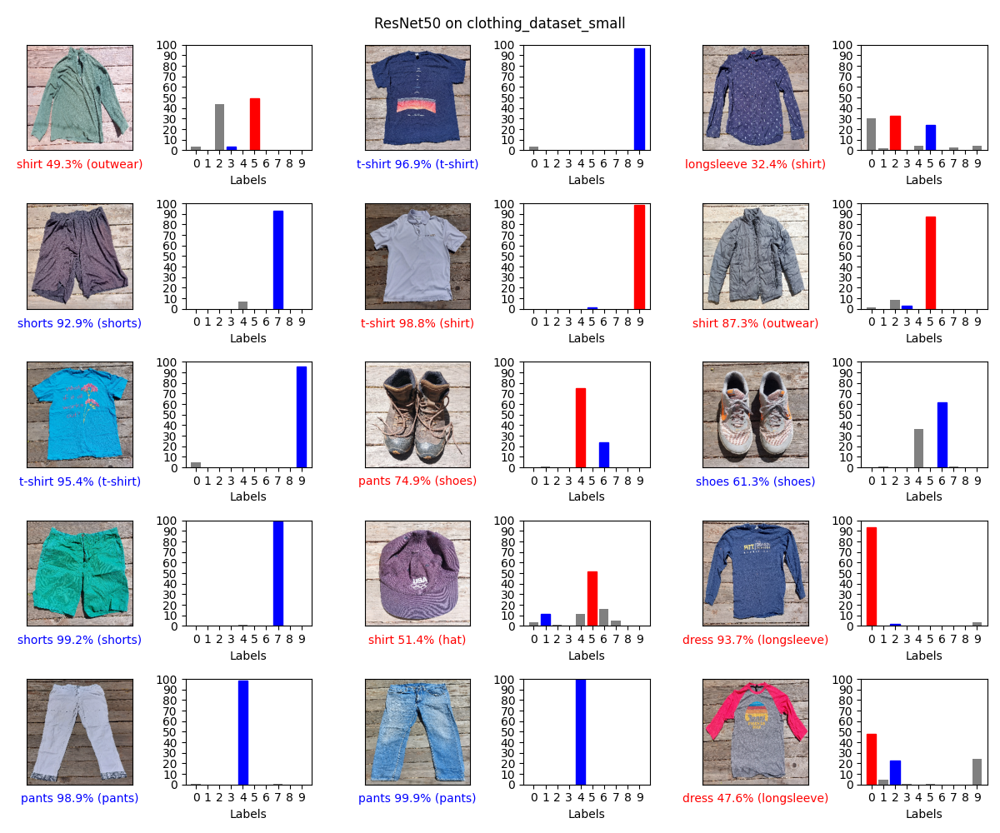
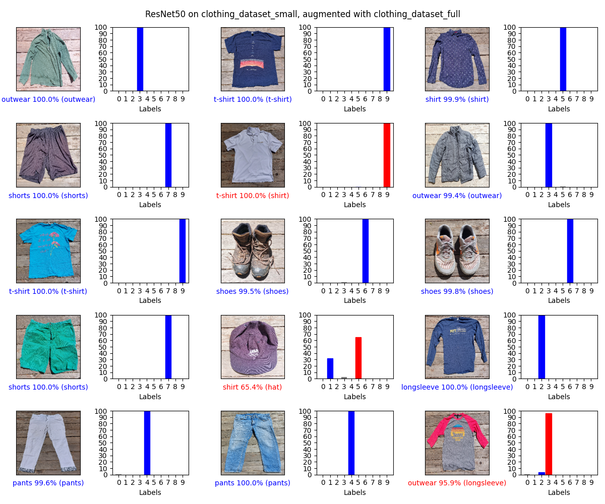

# cs230-project

## Laundry Image Classification

This repo's origin is a class project for [Stanford CS230 Deep Learning][1].
On the left and right you will see the output of a ResNet50 we fully trained.
The left image is only trained on one dataset (small),
the right image is trained on two datasets (small + full).
Please see the `data` directory for more information on the datasets available.

<p align="center">
  
&nbsp; &nbsp; &nbsp; &nbsp;
  
</p>

Explanation of left images:

- Label: {predicted class} {prediction probability}% ({true class})
- Blue text: correct prediction
- Red text: incorrect prediction

Explanation of right images:

- Blue bars: true class
- Grey bars: other
- Red bars (if present): incorrect prediction

## Developers

This project was developed using Python 3.8.

### Getting Started

Here is how to create a virtual environment to work with this repo:

```bash
python -m venv venv
source venv/bin/activate
python -m pip install --upgrade pip setuptools
python -m pip install -r requirements.txt
```

#### Including Code QA Tooling

We love quality code!  If you do too,
run these commands after creating the environment:

```bash
python -m pip install -r requirements-qa.txt
pre-commit install
```

### Debugging with `tensorboard`

Here is how you kick off `tensorboard`:

```bash
tensorboard --logdir training
```

Afterwards, go to its URL: [http://localhost:6006/](http://localhost:6006/).

[1]: https://cs230.stanford.edu/
